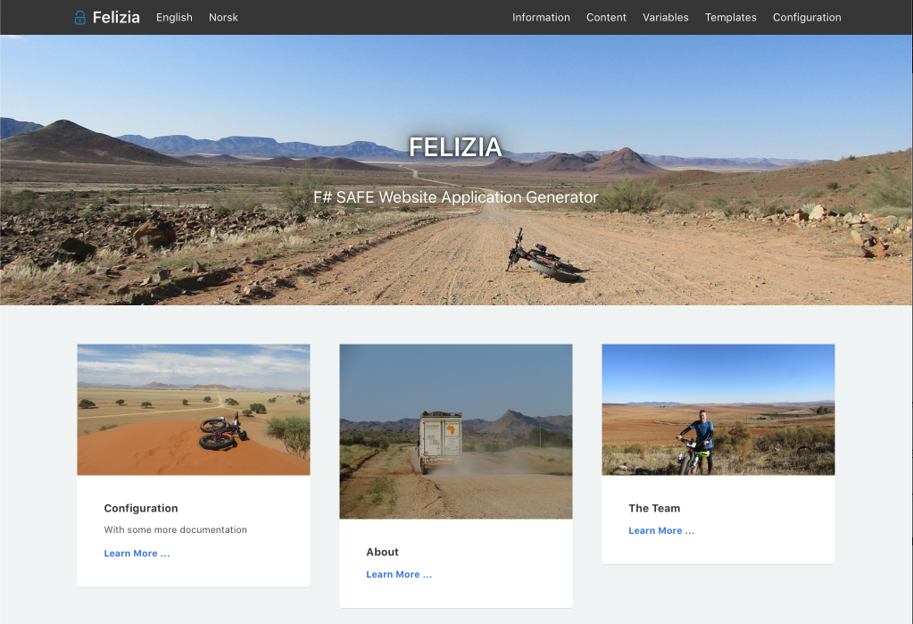

# Felizia

Felizia is a website application generator that renders your site the same way as you organize your content. Felizia
generates a dynamic isomorphic web application and exposes itself as a [Single page application
(SPA)](https://en.wikipedia.org/wiki/Single-page_application) but uses Server Site Rendering (SSR) to render the initial
page request.

Felizia config and content handling is heavily inspired by the static website generator [Hugo](https://gohugo.io/) but
built using [SAFE stack](https://safe-stack.github.io/) components such as [Fable](https://fable.io), [Elmish](https://elmish.github.io/elmish/) and [Giraffe](https://github.com/giraffe-fsharp/Giraffe).

Felizia uses [Feliz](https://github.com/Zaid-Ajaj/Feliz) and
[Feliz.ViewEngine](https://github.com/dbrattli/Feliz.ViewEngine) for templating and Markdown for content.



## Features

- **Content Management** Scalable and managable content. Folders becomes sections. Files becomes pages. Menues are
  generated from the top level sections and summaries are generated from the content.
- **Server Side Rendering (SSR)**, the initial request on every URL will be server side rendered (SSR). This gives
  better SEO (Search Engine Optimization), perceived quicker loading speed and enables previews in some social media
  sharing (Facebook, twitter, etc).
- **Single Page Application (SPA)**, subsequent navigation and requests will be client rendered. This gives quicker,
  almost instant switching between pages.j
- **Feliz Templating**, templates are separated from the content and written in F# using [Feliz](https://github.com/Zaid-Ajaj/Feliz) DSL syntax.
- **Multilingual Mode**, Internationalization (i18n) of pages and words. Translate whole pages or single words or
  sentences used in e.g navigation buttons or menues.
- **Markdown**. content files are written in Markdown.
- **Front-matter**, allows you to add front matter in Yaml to your content files.
- **Menues**, are automatically generated based on how you organize your content.
- **Site Configuration**, the site is configured using Yaml configuration.
- **Pagination**, both server and client side pagination.

## Install pre-requisites

You'll need to install the following pre-requisites in order to build SAFE applications

* The [.NET Core SDK](https://www.microsoft.com/net/download)
* [FAKE 5](https://fake.build/) installed as a [global tool](https://fake.build/fake-gettingstarted.html#Install-FAKE)
* The [Yarn](https://yarnpkg.com/lang/en/docs/install/) package manager (you an also use `npm` but the usage of `yarn`
  is encouraged).
* [Node LTS](https://nodejs.org/en/download/) installed for the front end components.

## Work with the application

To concurrently run the server and the client components in watch mode use the following command:

```bash
fake build -t run
```

## Content Organization

All content is organized in the `content` folder. Pages are added as Markdown files e.g `Welcome.md`. Pages can be
organized in Sections by placing them inside folders, thus the sections are generated based on how you organized your
content. Content can be translated to other languages by adding a language code to the file e.g `Welcome.nb.md` or
`Welcome.fr.md`.

## The Felizia Technology Stack

Felizia is built on the shoulders of some amazing F# technology. You will find more documentation about the used F#
components at the following places (alphabetical order):

* [Elmish](https://elmish.github.io/elmish/), MVU pattern for Fable applications
* [Fable](https://fable.io/docs/), F# compiler powered by Babel
* [Feliz](https://github.com/Zaid-Ajaj/Feliz), React DSL
* [Feliz.Bulma](https://github.com/Dzoukr/Feliz.Bulma), React DSL
* [Feliz.ViewEngine](https://github.com/dbrattli/Feliz.ViewEngine), Server side React DSL
* [Giraffe](https://github.com/giraffe-fsharp/Giraffe/),ASP.NET Core web framework
* [Legivel](https://github.com/fjoppe/Legivel), YAML parser
* [SAFE Stack](https://safe-stack.github.io), An and-to-end, functional-first technology stack.

## Documentation

Documenation is currently self-hosted. Run the application to browse the documentation.

## Terminology and Links

- Configuration
  - Configuration file (https://gohugo.io/getting-started/configuration/)

- Content (https://gohugo.io/content-management/organization/)
  - Organization (https://gohugo.io/content-management/organization/)
  - Sections (https://gohugo.io/content-management/sections/)
  - Menues (https://gohugo.io/content-management/menus/)
  - Multilingual and i8n (https://gohugo.io/content-management/multilingual/)
  - Front matter (https://gohugo.io/content-management/front-matter/)

- Templates
  - Overview (https://gohugo.io/templates/)
  - Single page templates (https://gohugo.io/templates/single-page-templates/)
  - List page templates (https://gohugo.io/templates/lists/)
  - Section templates (https://gohugo.io/templates/section-templates/)
  - Lookup order  (https://gohugo.io/templates/lookup-order/)
  - Partials (https://gohugo.io/templates/partials/)

- Variables
  - Site (https://gohugo.io/variables/site/)
  - Page (https://gohugo.io/variables/page/)

- Taxonomies (currently not implemented), i.e tags (https://gohugo.io/content-management/taxonomies/)

## Differences from Hugo

- Felicia is a dynamic (non-static) website application generator. Static-generation of all pages should be possible and may be added in future releases.

- Templates, i.e Layouts and Partials needs to be compiled and thus be part of both Client.fsproj and Server.fsproj. Mapping of URLs to custom templates must be done in `Routing.fs`. If not mapped then default templates, i.e `ListPage.fs` or `SinglePage.fs` will be used for sections and pages.

- Only YAML supported for config. Other configuration languages such as JSON and TOML might be added in future.

- `Page.Site` is not available from pages. The site is however directly available in the model. This is to reduce the
  size of JSON state that needs to be transferred to the client in the initial request.

- The `Params` field of front-matter and site config is currently hard coded so you cannot add anything you want there. This might
  be fixed later when we figure out how to customize the YAML parser.

## TODO

- Taxonomies

- Data folder

- Many other things are currently not supported. Please provide feature request as a PR.
